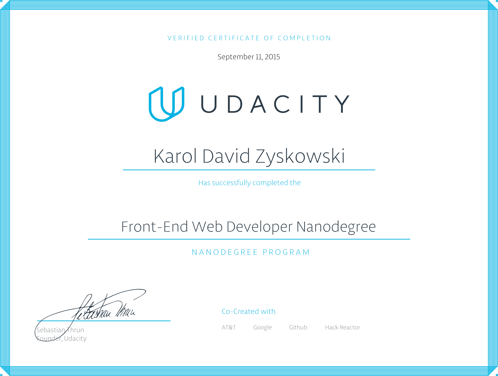

# Front-End Web Development Nanodegree Certificate

## Projects

* [Neighborhood Map App](karoldavid.github.io/neighborhood-map/)

Single-page, responsive application built with Knockout.js framework

* [Feed Reader Testing](https://github.com/karoldavid/feedreader)

Test a Feedreader application using Jasmine

* [Website Optimization](karoldavid.github.io/website-optimization/)

Optimized critical rendering path of existing website and eliminated inefficiencies in the website's scroll animation

* [Classic Arcade Game](karoldavid.github.io/arcade-game/)

Coded player, enemies, and other game entities in JavaScript's object-oriented pseudo-classical style

* [Online Resume](karoldavid.github.io/interactive-resume/)

Given a helper library and resume template created an online resume using jQuery

* [Online Portfolio](https://github.com/karoldavid/portfolio-site)

* [Mockup To Article](https://github.com/karoldavid/mockup-to-article)

* [Mockup To Website](https://github.com/karoldavid/mockup2website)

## Author

* **Karol Zyskowski**

Questions? Send an email to: k.zysk@zoho.com

## Acknowledgements

* https://www.udacity.com/course/front-end-web-developer-nanodegree--nd001

